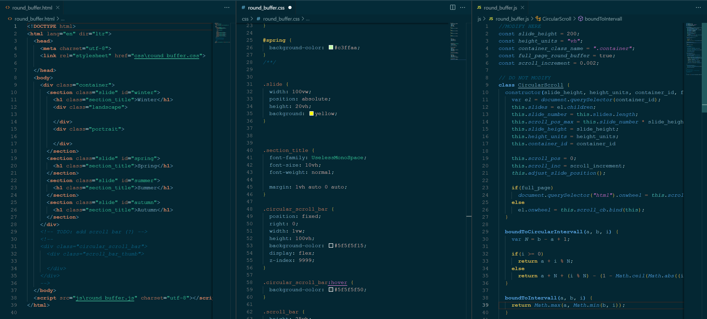
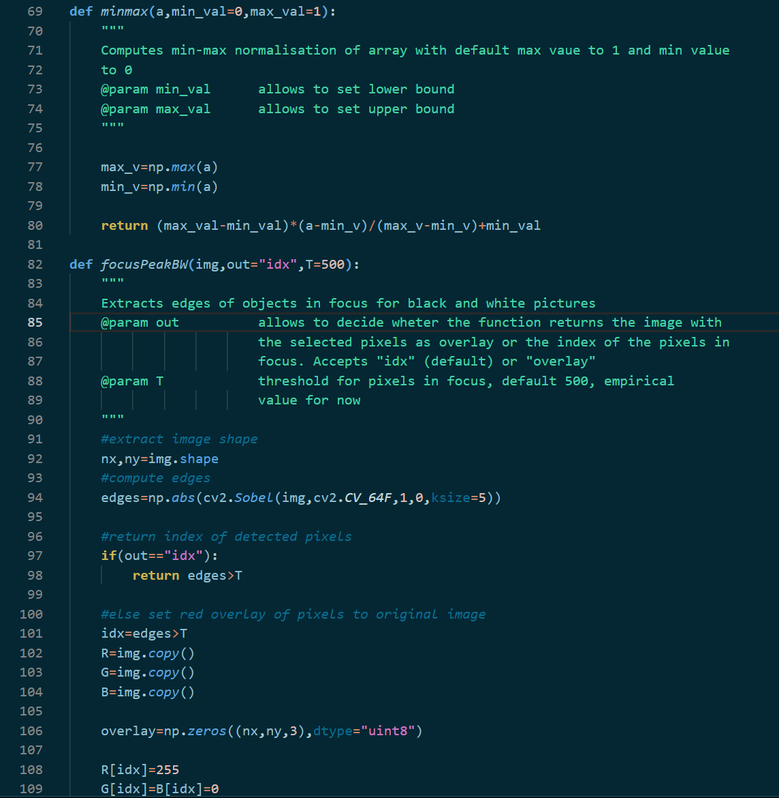
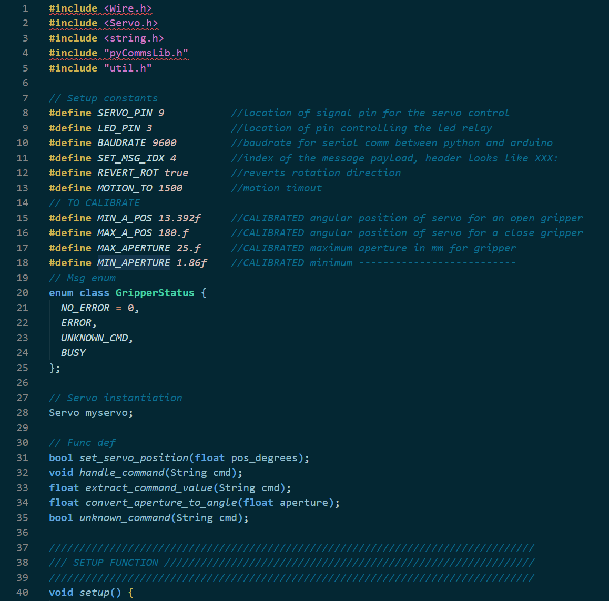
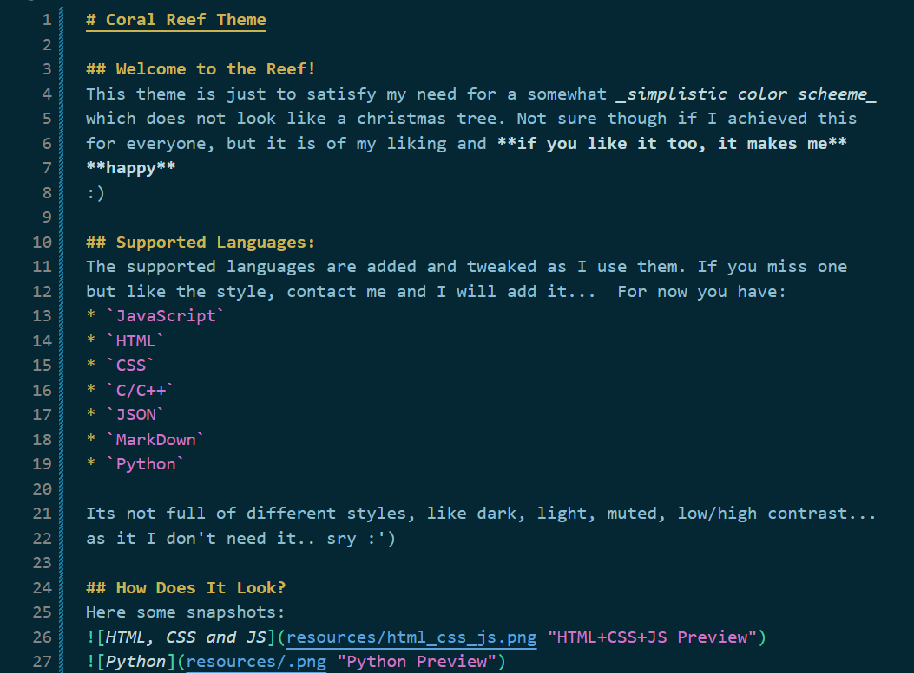
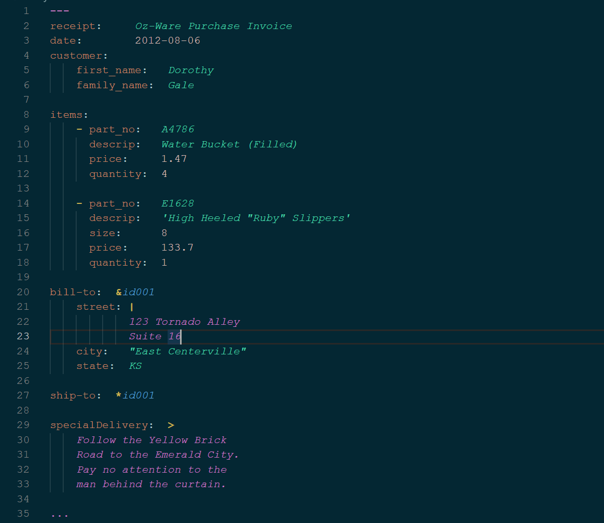

# Coral Reef Theme

## Welcome to the Reef! 
This theme is just to satisfy my need for a somewhat _simplistic color scheeme_ 
which does not look like a christmas tree. Not sure though if I achieved this 
for everyone, but it is of my liking and **if you like it too, it makes me** 
**happy** 
:)

## Supported Languages:
The supported languages are added and tweaked as I use them. If you miss one 
but like the style, contact me and I will add it...  For now you have:
* `JavaScript`
* `HTML`
* `CSS`
* `C/C++`
* `JSON` and `YAML`
* `MarkDown`
* `Python`

Its not full of different styles, like dark, light, muted, low/high contrast... 
as it I don't need it.. sry :')

## Suggestions?
If you feel like there are languages missing or spotted a part which is not 
coherent with the rest of the template let me know it. You can open an issue, 
and I will try to resolve it ASAP. If there are some singular bugs or artefacts 
with the existing color schemes you can always send me a screenshot to help me 
understand the problem. It would be best with the inspected token visible (to 
do so: `Ctrl`+`Shift`+`P`, then type `Inspect Editor Tokens and Scopes` and 
click on the word, sentence or whatever in the editor which is not correctly 
displayed and take a screenshot of it). Thanks :v:

## How Does It Look?
Here some snapshots:

